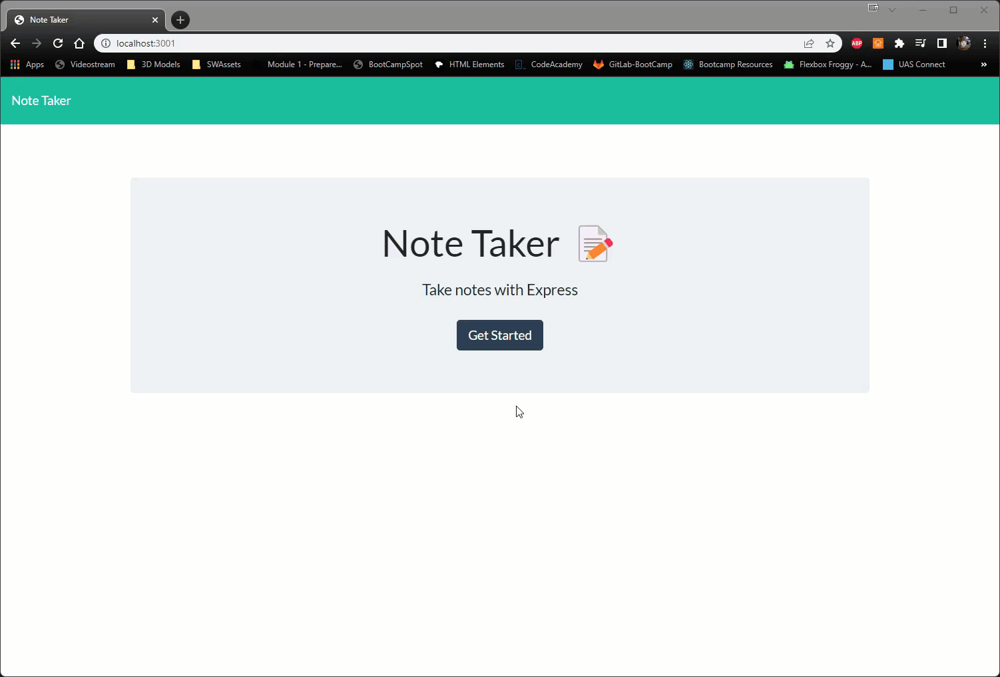

# Note_Taker
  

  ## Description:
My assignment is to modify starter code to create an application that can be used to write and save notes. This application will use an Express.js back end and will save and retrieve note data from a JSON file.  The application’s front end has already been created by class instructors. It's my job to build the back end, connect the two, and then deploy the entire application to Heroku.

  ## Table of Contents
  - [Installation](#installation)
  - [Usage](#usage)
  - [Contribution](#contribution)
  - [License](#license)
  - [Git Info](#git-info)
  - [Contact](#contact-me)

  # Installation
    No installations required for web app. If cloned and pulled down to client, you will need the following npm packages:
    express, path, util, & uuid. Then run using 'npm start'.

  # Usage
 When navigating to the homepage with the banner "Note Taker" click on "Get Started"
 This should take you to the main note taker page.
 When you enter a title, and a note, then click the disk shaped "save" button in the upper right. Your note should be saved on the column to the left.
 Once saved, you can click on this note to view it again.
 To delete a note, click on the red garbage can shaped icon to the right of the corresponding note!

  

 [Heroku Link](https://secret-chamber-82068.herokuapp.com/)

  # Tests
  No tests have been written for this application.

  # Contribution
  It should absolutely be noted that I did not write the front end code!
  Open to any and all contributions though!

  # Git Info
  Username: AuraFly
  [GitHub Profile](https://github.com/AuraFly)

  # Contact Me
  [Contact Me](mailto:AuraFlyDev@gmail.com)

  # License
  This application is covered under the MIT open source license.

